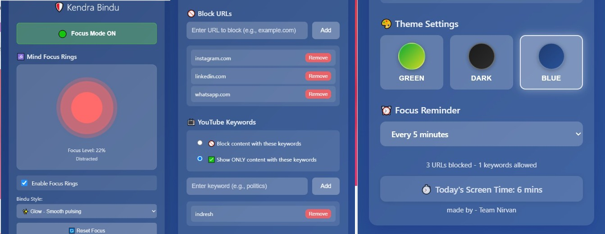

# 🌱 KendraBindu 2.0 – Focus Extension

A **smart Chrome extension** that helps you stay focused and boost productivity with real-time focus visualization.  
> 🎯 Mindful productivity tool with intelligent focus tracking, distraction blocking, and beautiful animations.

---

## ✨ Key Features

### 🕉️ **Mind Focus Rings (Bindu Visualization)** ⭐ NEW!
- Real-time animated focus indicator (0-100%)
- **4 color zones**: Red (Distracted) → Orange (Scattered) → Green (Focused) → Blue (Peak Focus)
- **3 animation styles**: ✨ Glow, 🌊 Ripple, ⚪ Minimal
- Tracks: Tab switches, idle state, window focus, blocked site visits
- Updates every 5 seconds at smooth 60 FPS

### 🚫 **Smart URL Blocker**
- Block distracting websites with one click
- Redirect blocked sites to custom page
- Cloud-synced blocked list across devices
- Toggle blocking on/off with Focus Mode

### 📺 **YouTube Keyword Blocker**
- Filter YouTube videos by keywords
- Block Mode: Hide videos with specific keywords
- Allow Mode: Show ONLY videos with specific keywords
- Real-time filtering, instant updates

### 🎨 **Beautiful Customization**
- 3 theme colors: Green, Dark, Blue
- Smooth gradient UI
- Custom reminder intervals (5-30 minutes)
- Real-time theme switching

### 📊 **Screen Time Tracking**
- Minutes tracked per day
- Auto-reset at midnight
- Reminders to take breaks
- Visual feedback on usage

### 💚 **Focus Mode Master Control**
- One-click enable/disable all blocking
- Pause without losing your blocked URLs
- Shows real-time focus status
- Integrates with Bindu visualization

### 🔒 **100% Privacy**
- No cloud tracking or analytics
- All data stays local on your device
- Settings sync to Chrome cloud (your choice)
- Zero third-party services

---

## 📊 How Bindu Works

```
Your Activity → background.js Monitors → Focus Level Calculated (0-100%)
                                                ↓
                                    Canvas Animation (60 FPS)
                                                ↓
                                      You See Colored Circle
                                      
Tab Switch (-20 pts)        Idle/Away (-5 pts)         Continuous Work (+2 pts/5sec)
Blocked Site (-30 pts)  →   Focus Level Updates   ←    Focus Mode ON (+15 pts)
```

### Color Meanings:
| Color | Range | Meaning | Action |
|-------|-------|---------|--------|
| 🔴 **Red** | 0-30% | Distracted | Take a break |
| 🟠 **Orange** | 30-50% | Scattered | Refocus |
| 🟢 **Green** | 50-80% | Focused | Keep going! |
| 🔵 **Blue** | 80-100% | Peak Focus | In the zone! 🎯 |

---

## 🧠 Tech Stack

- **Framework**: Chrome Manifest V3 (latest standard)
- **Frontend**: HTML5, CSS3, Vanilla JavaScript
- **Canvas**: HTML5 Canvas 2D API (60 FPS animations)
- **Storage**: Chrome Storage API (sync + local)
- **APIs Used**: 
  - `tabs`, `windows`, `idle` (activity tracking)
  - `declarativeNetRequest` (URL blocking)
  - `alarms` (reminders)
  - `notifications` (alerts)
- **Performance**: <1% CPU (background), 5-8% (popup open)

---

## 🖼️ Screenshots
### 🔹 Full Extension Preview
Here’s a live look at **KendraBindu 2.0** — showing the Mind Focus Rings, URL Blocker, YouTube Filter, Theme Settings, and Screen Time Tracker — all in one view:



---
### Bindu Visualization Active
```
┌─────────────────────────────────┐
│  🕉️ Mind Focus Rings           │
├─────────────────────────────────┤
│   [Animated Circle Animation]   │
│   Focus Level: 85%              │
│   Calm & Centered 🔵            │
│                                 │
│  ☑️ Enable Focus Rings          │
│  Bindu Style: Glow ▼            │
│  🔄 Reset Focus                 │
└─────────────────────────────────┘
```

### Complete Popup Features
- 🕉️ Bindu Visualization (top)
- 💚 Focus Mode Toggle (active)
- 🚫 Block URLs section
- 📺 YouTube Keywords section
- 🎨 Theme Customizer
- ⏰ Reminder Interval
- 📊 Screen Time Display

---

## ⚙️ Installation

### From GitHub (Development)
```bash
# 1. Clone the repository
git clone https://github.com/ka0913560-hub/Kendrabindu-Focus-Extension.git
cd Kendrabindu-Focus-Extension

# 2. Open Chrome extensions page
# Go to: chrome://extensions/

# 3. Enable Developer Mode (top right)

# 4. Click "Load unpacked" 

# 5. Select the cloned folder

# 6. Done! Extension is now active
```

### From Chrome Web Store (Coming Soon)
- Extension will be available on Chrome Web Store soon!

---

## 🚀 How to Use

### 1. Enable Focus Mode
- Click the green **"Focus Mode ON"** button
- All blocking rules become active

### 2. Add Blocked Websites
```
Input: facebook.com
Click: Add URL
Result: Blocked whenever you visit
```

### 3. Filter YouTube (Optional)
```
Input: politics
Mode: Block (to hide) or Allow (to show only)
Click: Add Keyword
Result: YouTube filters videos in real-time
```

### 4. Watch Your Focus Level
```
Enable Focus Rings checkbox
→ See animated Bindu circle
→ Color changes based on your activity
→ Challenge yourself to keep it BLUE! 🔵
```

### 5. Choose Animation Style
```
Dropdown: Glow / Ripple / Minimal
→ Pick your favorite visual style
→ Updates instantly
```

### 6. Monitor Screen Time
- See daily minutes at bottom of popup
- Auto-resets at midnight
- Get reminders based on your interval

---

## 📖 Documentation

Complete guides included in the repo:

1. **BINDU_30_SECOND_EXPLANATION.md** - Quick 30-sec overview
2. **BINDU_QUICK_VISUAL_GUIDE.md** - Visual examples & scenarios
3. **BINDU_FOCUS_TRACKING_EXPLAINED.md** - Complete system explanation
4. **BINDU_SYSTEM_ARCHITECTURE.md** - Technical architecture & diagrams
5. **BINDU_COMPLETE_GUIDE.md** - Quick reference & FAQs
6. **BINDU_COMPLETE_DEEP_DIVE.md** - Everything in detail
7. **README_DOCUMENTATION_START_HERE.md** - Where to begin

---

## 🔒 Privacy & Security

### What We Track (Locally Only)
✅ Current focus level  
✅ Browser activity (tab switches, idle state)  
✅ Today's screen time  

### What We DON'T Track
❌ Websites you visit (only current tab)  
❌ Browsing history  
❌ Personal data  
❌ External servers  
❌ Tracking cookies  

### Data Storage
- **Local Storage**: Real-time focus data (device only)
- **Cloud Sync**: Settings & blocked URLs (your choice)
- **Security**: All Chrome APIs are legitimate and official

---

## 💡 Use Cases

### 👨‍🎓 Students
- Block social media while studying
- Watch focus circle to stay on task
- Monitor daily study hours
- Get break reminders

### 💼 Office Workers
- Block news sites during work hours
- Focus Mode keeps you productive
- Track deep work sessions
- Gamify your productivity

### 🧘 Anyone Seeking Focus
- Real-time awareness of your focus level
- Beautiful visual feedback
- Motivational gamification
- Privacy-first design

---

## 🎯 Productivity Tips

### To Keep Circle BLUE (Peak Focus):
1. Enable Focus Mode
2. Block your main distractions first
3. Stay on same task >30 minutes
4. Disable notifications
5. Take strategic breaks

### When Circle Goes RED:
1. Click "Reset Focus" button
2. Identify what distracted you
3. Block that website if needed
4. Return refreshed and refocus

### Best Practices:
- Challenge yourself daily to reach BLUE zone
- Set realistic blocked URL list
- Use reminders for break intervals
- Monitor your screen time trends

---

## 📊 Technical Details

### Performance
- Background: <1% CPU, ~2 MB memory
- Popup Open: 5-8% CPU, ~3 MB memory
- Canvas: 60 FPS smooth animation
- Update Interval: Every 5 seconds
- Total Size: ~150 KB

### Browser Support
✅ Chrome 90+  
✅ Edge 90+  
✅ Brave (Chromium-based)  
✅ Opera 76+  

### APIs Used
- `chrome.tabs` - Detect tab activity
- `chrome.windows` - Window focus tracking
- `chrome.idle` - User idle detection
- `chrome.storage` - Local & cloud storage
- `chrome.declarativeNetRequest` - URL blocking
- `requestAnimationFrame` - Canvas animation

---

## 🛠️ Development

### Project Structure
```
kendrabindi2.0/
├── manifest.json              # Extension configuration
├── popup.html                 # Popup UI
├── popup.js                   # Popup logic + Bindu animation
├── popup.css                  # Styling
├── background.js              # Service worker + focus tracking
├── url-blocker.js             # URL blocking logic
├── youtube-blocker.js         # YouTube filtering
├── blocked.html               # Blocked page template
├── blocked.js                 # Blocked page script
├── focus-visualizer.js        # Focus tracking reference
├── rules.json                 # Blocking rules
├── icons/                     # Extension icons
├── _metadata/                 # Chrome metadata
└── Documentation/             # 10 comprehensive guides
```

### Key Files

**popup.js** (322 lines)
- Handles all UI interactions
- Canvas drawing functions (Glow, Ripple, Minimal)
- Focus display updates
- Settings management

**background.js** (482+ lines)
- Focus level calculation
- Activity tracking (tabs, windows, idle)
- Message communication
- Screen time tracking

**manifest.json**
- Extension metadata
- Permissions & APIs
- Content scripts configuration
- Declarative net request rules

---

## 🤝 Contributing

Found a bug? Have an idea? Feel free to:
1. Open an issue on GitHub
2. Submit a pull request
3. Share feedback

---

## 📝 License

Open source. Feel free to use and modify!

---

## 🎓 Learn More

- Read the documentation in the repo
- Check out our 10 comprehensive guides
- Explore the code comments
- Visit our GitHub: https://github.com/ka0913560-hub/Kendrabindu-Focus-Extension

---

## 🕉️ Final Thought

> **"KendraBindu transforms your relationship with productivity. By visualizing your focus in real-time, you become aware. By becoming aware, you change. By changing, you achieve amazing things."**

---

**Ready to boost your focus? Download KendraBindu 2.0 today!** 🚀✨

Made with ❤️ by Team Nirvan

🧠 + 📊 + 🎨 = **PEAK PRODUCTIVITY! 🎯**
