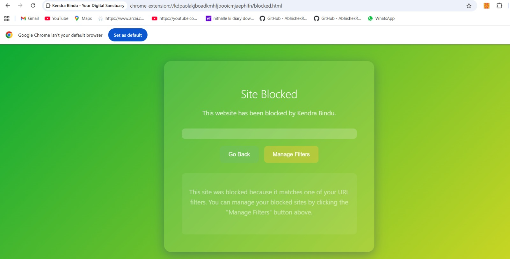

# 🌱 KendraBindu – Focus Extension

A smart Chrome extension that helps users stay focused and block distractions.  
> 🎯 Mindful productivity tool that allows learning content and blocks time-wasters.

---

## 🚀 Features
- 🧘 Smart “Focus Mode” toggle  
- 🎯 Block distracting websites in one click  
- ⚡ Lightweight & fast – works fully offline  
- 🔒 100% privacy – no cloud tracking  

---

## 🧠 Tech Stack
- Chrome Manifest V3  
- JavaScript, HTML, CSS  
- DeclarativeNetRequest API  
- IndexedDB / Local Storage  

---

## 🖼️ Project Preview

| Focus Mode Popup | Blocked Page |
|------------------|--------------|
|  |  |

---

## ⚙️ Installation

1. Clone the repo:
   ```bash
   git clone https://github.com/ka0913560-hub/Kendrabindu-Focus-Extension.git
