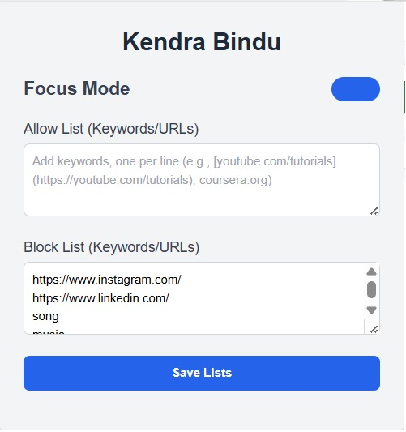
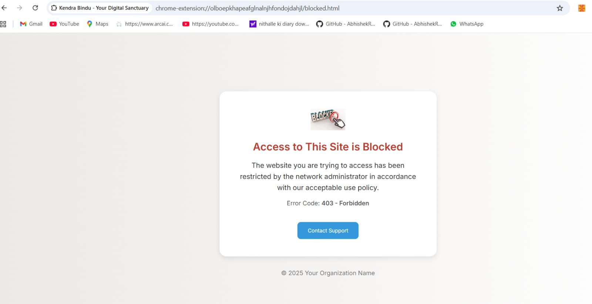

# Kendra Bindu – Your Digital Focus Sanctuary 🌱

A smart Chrome extension built for **Code Veda Hackathon 2025** to help users stay focused online without over-restricting.

---

## 🔥 Problem
- 75% of students struggle to study for more than 30 minutes without distractions.  
- On average, people waste 4+ hours daily browsing irrelevant content.  
- Existing blockers are too strict — they block whole sites instead of allowing mindful use.

---

## ⚡ Solution
**Kendra Bindu** provides precision blocking:
- ✅ Smart conditional blocking (allow tutorials, block entertainment)  
- ✅ Allow List & Block List modes  
- ✅ One-click Focus Mode toggle  
- ✅ Local storage (privacy friendly) — no cloud dependency

---

## 🛠 Tech Stack
- **Frontend:** HTML, CSS, JavaScript  
- **Chrome APIs:** chrome.tabs, chrome.storage (or Chrome Storage API), webNavigation, alarms  
- **Storage:** Chrome Storage API / IndexedDB

---

## 📸 Screenshots

### Extension Popup

### Blocked Website Page

## 🧩 File Structure (recommended)
